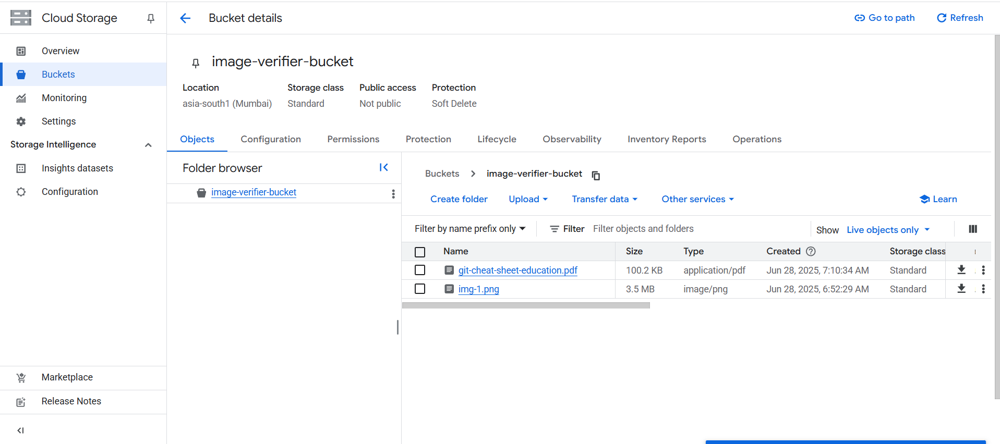
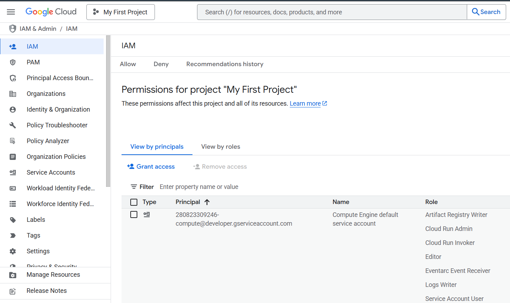

Image Type Verifier using Google Cloud Platform (GCP)

This project is built for submission as per the given project guidelines. It uses 4 GCP services and demonstrates a real-time event-driven pipeline that verifies the file type of uploaded images.

✅ WHAT THE PROJECT DOES

Whenever a file is uploaded to a Cloud Storage bucket, a Pub/Sub message is triggered and sent to a Cloud Run service. The service checks whether the uploaded file is a valid image type (e.g. JPG, PNG) and logs the result accordingly.

☁️ CLOUD SERVICE USED

Cloud StorageUsed to upload images (e.g. .jpg, .png, .pdf, etc.) to a bucket.

Cloud Pub/SubAutomatically triggered when a new file is uploaded to the bucket. It pushes the file metadata to a Cloud Run endpoint.

Cloud RunRuns a Python microservice that receives metadata, checks file type, and logs whether it's a valid image.

IAM (Identity and Access Management)Grants Pub/Sub permission to securely invoke the Cloud Run service.

🔁 PROJECT FLOW

A user uploads a file (e.g. test.jpg) to the Cloud Storage bucket.
Cloud Storage triggers a Pub/Sub message with metadata about the file.
Pub/Sub pushes the message to Cloud Run.
Cloud Run parses the message, checks the file type, and logs either ✅ Valid image or ❌ Invalid type.

🔗 HOW THE SERVICES CONNECT

Here's how each GCP service is connected in this project:

Cloud Storage acts as the entry point. A user uploads an image to a bucket.

That upload triggers a Pub/Sub Topic, which is configured to receive notifications from that specific bucket.

The Pub/Sub Subscription is a push type, meaning it forwards the message to the Cloud Run URL.

Cloud Run hosts a Python API that receives and processes the message.

IAM ensures that the Pub/Sub service account has permission to invoke the Cloud Run service securely

## 📸 Screenshots

### ✅ Cloud Run Log Output

### ✅ Cloud Storage Bucket

### ✅ Pub/Sub Topic & Subscription

### ✅ IAM Role Binding

